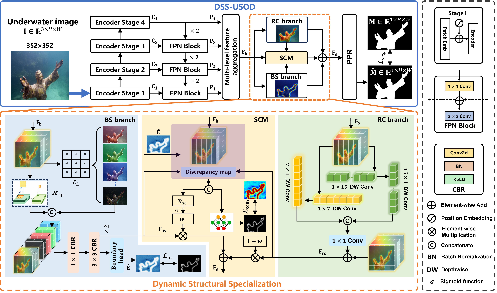

# DSS-USOD
Source code for our paper **[Learning Dynamic Structural Specialization for Underwater Salient Object Detection](https://arxiv.org/abs/2506.19472)**.

Created by **Lin Hong**, email: eelinhong@ust.hk

---

## Overview
The [trained model](https://pan.baidu.com/s/1TwwaTcdmTiU2FHOC5xC3Vw) (Baidu Netdisk, fetch code: ie0k) or [Google Drive (DSS-USOD baseline)](https://drive.google.com/file/d/1fFKhuuR2MEEjBWRtjFdMZCoRxL) can be downloaded.



### Requirements
- Python 3.11
- PyTorch 2.5.0+cuda124
- TorchVision 0.20.0+cuda124
- Numpy 2.2.6

---
### Model Training & Inference
## Train Your Own Model
1. Download the USOD10K dataset and place it in the `data` folder.
2. Update the `datapath` config to your local dataset path.
3. Run training:
   `python train.py`

## Inference with Pre-trained Model
1. Download the trained model checkpoint and place it in the `checkpoints` folder.
2. Run inference:
   `python inf.py`
---
## Benchmark
We retrained 40 SOTA methods in the fields of SOD and USOD. Here is the qualitative evaluation of the 40 SOTA methods and the proposed DSS-USOD baseline.


### Available Resources
1. **Predicted saliency maps of USOD10K**  
   Baidu Netdisk: [Link](https://pan.baidu.com/s/1EpnE07lgamyaUIUZWdccqA) | Fetch code: usod  
   Google Drive: [Link](https://drive.google.com/file/d/1D4wLLol843DEpolmO-cYpo2jaiBY7Ufn/view?usp=drive_link)

2. **Predicted saliency maps of USOD**  
   Baidu Netdisk: [Link](https://pan.baidu.com/s/1cnmMZ0JSshssm2jc9p2BdA) | Fetch code: usod  
   Google Drive: [Link](https://drive.google.com/file/d/1YoXKUKaauy2PkkISpK-QWJpetXIsTsrO/view?usp=drive_link)

3. **Evaluation results**  
   Baidu Netdisk: [Link](https://pan.baidu.com/s/1AL4WQeFh1KrD0jj9JW182g) | Fetch code: usod  
   Google Drive: [Link](https://drive.google.com/file/d/1jCuCvK-UJYq3g_TMQ7NTWqXfXbG21bk/view?usp=drive_link)

---

## Bibliography Entry
If you think our work is helpful, please cite:

```bibtex
@ARTICLE{10102831,
  author={Hong, Lin and Wang, Xin and Zhang, Gan and Zhao, Ming},
  journal={IEEE Transactions on Image Processing},
  title={USOD10K: A New Benchmark Dataset for Underwater Salient Object Detection},
  year={2025},
  volume={34},
  number={},
  pages={1602-1615},
  doi={10.1109/TIP.2023.3266163}
}
```

---

## Acknowledgements
We thank the developer of the 40 representative methods for providing their open-source code, which greatly facilitated our benchmark evaluations.
The authors would like to express their sincere gratitude to Prof. Deng-Ping Fan for his valuable suggestions and insightful discussions.

---

## Note to Active Participants
We hope this work offers a new perspective on RGB-based USOD by demonstrating the importance of explicitly disentangling and dynamically coordinating complementary structural representations learned from underwater images. Your contributions and feedback are welcome!
